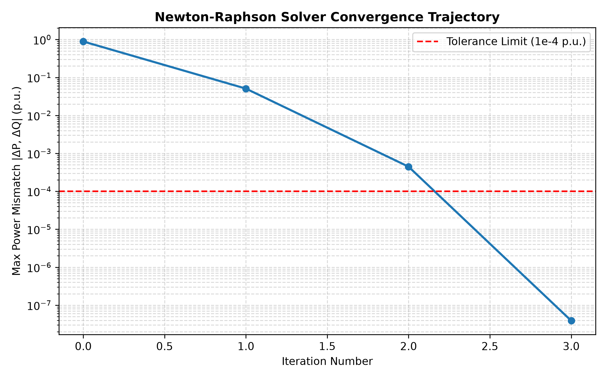
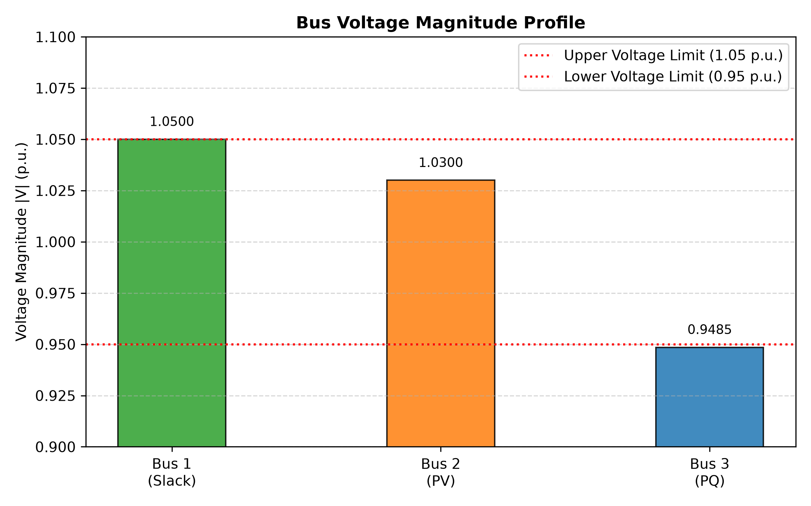

# Power Systems Newton-Raphson Load Flow Solver


An object-oriented Python implementation of the **Newton-Raphson Load Flow Algorithm** engineered for power grid dynamic stability and power flow calculation. Validated against standard **3-bus** and **IEEE 14-bus benchmark networks**.

## Key Features
* **Admittance Matrix Formulation:** Automated dynamic $Y_{bus}$ matrix construction considering line resistance ($R$), reactance ($X$), and shunt susceptance ($B/2$).
* **Full Jacobian Engine:** Complete derivative evaluation across four dynamic sub-matrices ($J_{11}, J_{12}, J_{21}, J_{22}$) supporting Slack, PV, and PQ buses.
* **Transmission Loss Analysis:** Complex power flow ($S_{ij}$) and real/reactive transmission loss calculations ($S_{loss}$).
* **Automated Test Suite:** `pytest` verification covering $Y_{bus}$ matrix symmetry and numerical convergence.

## Mathematical Formulation
The non-linear active and reactive power balance equations solved per bus $i$:

$$P_i = \sum_{j=1}^{N} \vert{}V_i\vert{}\vert{}V_j\vert{}(G_{ij}\cos\theta_{ij} + B_{ij}\sin\theta_{ij})$$

$$Q_i = \sum_{j=1}^{N} \vert{}V_i\vert{}\vert{}V_j\vert{}(G_{ij}\sin\theta_{ij} - B_{ij}\cos\theta_{ij})$$

State updates $\Delta x = [\Delta \theta, \Delta \vert{}V\vert{}]^T$ are calculated iteratively via the inverse Jacobian system:

$$\begin{bmatrix} \Delta P \\ \Delta Q \end{bmatrix} = \begin{bmatrix} J_{11} & J_{12} \\ J_{21} & J_{22} \end{bmatrix} \begin{bmatrix} \Delta \theta \\ \Delta \vert{}V\vert{} \end{bmatrix}$$

## Simulation Artifacts & Convergence
Convergence is achieved quadratically within **3 iterations** on benchmark cases ($tol = 10^{-4}\text{ p.u.}$).

### Convergence Trajectory


### Bus Voltage Profile


## Repository Structure
```text
├── main.py                   # Primary solver entry point
├── requirements.txt          # Package dependencies
├── src/                      # Source modules
│   ├── bus_data.py           # 3-bus test network specification
│   ├── ieee14_data.py        # IEEE 14-bus benchmark parameters
│   ├── ybus_builder.py       # Admittance matrix builder
│   ├── mismatch_calculator.py# Delta P & Delta Q mismatch engine
│   ├── jacobian_builder.py   # Jacobian matrix constructor
│   ├── nr_solver.py          # Iterative Newton-Raphson loop
│   ├── line_flow_calculator.py # Line flow & loss calculation
│   └── visualizer.py         # Matplotlib rendering module
├── tests/                    # Unit testing suite
│   ├── test_ybus.py          # Admittance matrix test cases
│   └── test_nr_solver.py     # Convergence test cases
└── results/                  # Exported plots and simulation output
